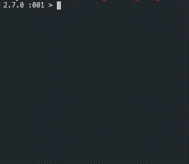

 

<h1 align="center">
  Faye Carter
</h1>

  

 

[Projects ](#projects) |
[Skills ](#skills) |
[Education ](#education) |
[Experience ](#experience) |
[Other Projects ](#experience) |
[Fun Facts ](#hobbies)

 

---

 

I am a **Full Stack Engineer** and recent graduate of the highly selective programming boot camp [Makers Academy](https://makers.tech/).

I have a BA in Architecture and a background in control systems and electrical and mechanical maintenance engineering, which I have worked for the past seven years. Alongside my work as an engineer, I taught myself the basics of programming, familiarizing myself with Python and building small scale projects to improve the working environment and daily tasks for myself and my team.

As a graduate of the Makers Academy, I now have the skills to build complex, full stack applications using JavaScript and Ruby. I am trained in OOP, TDD, pair programming and using agile processes.

During my time at Makers, I have fallen in love with coding and am excited to bring my passion and enthusiasm to a new role.

## Projects

This is a selection of projects that I have worked on. To see more,  [please see my Github](https://github.com/FayeCarter?tab=repositories).

| Project | Description |
| -- | :--: |
|The aim of the project was to create a welcoming chat room environment for developers to ask for help.   Users can access the site using their GitHub Login details, create a room based around their concern, post a question and receive feedback in real-time.   If the user wants to send a code block, it can be entered using markdown by typing three backticks followed by the language their code is written in. The message will be formatted as a code block in the specified language highlighting variables and correctly indenting each line.    **Tech Stack**   Sockets, OAuth, React,  Node, Express,  MongoDB    **Testing Frameworks**   Jest,  React Testing Library  | **[WhatStack](https://github.com/FayeCarter/WhatStack)**   [WhatStack - Live](http://whatstack.herokuapp.com/)     |
| A command-line Ruby application allowing you to create a bank account, make deposits, withdraw money and print statements.   The aim of this project was to focus fully on the TDD process with writing clean, DRY code.    **Tech Stack**   Ruby    **Testing Frameworks**   RSpec   | **[Bank](https://github.com/FayeCarter/bank_tech_test)**     |
| A Ruby/Sinatra web application.   The player can enter their name and play 'Rock, Paper, Scissors' against the computer. The game tracks the game score so the player can see how successful they are.    **Tech Stack**   Ruby, Sinatra, CSS, HTML    **Testing Frameworks**   RSpec   | **[Rock, Paper, Scissors](https://github.com/FayeCarter/rps-challenge)**     |
| **Work in progress**    A small scale Chrome Extension allowing users to visit BBC GoodFood recipes and see what time their recipe will be ready if the start cooking now.    **Tech Stack**   JavaScript, Chrome API | **[RecipeTimer](https://github.com/FayeCarter/recipeTimer)**     |

## Skills

### Assertive Learner

In June 2017 I joined Amazon as an enthusiastic apprentice engineer. I set myself a goal to engage daily with new processes, to ask questions and learn from experienced Engineers and to spend my spare time researching the new skills I was learning. In under six months I was the technical lead for my team in controls based faults, and quickly became known for my ability to absorb new information quickly.

### Innovate and Streamline

I take great joy in finding simple solutions for complex problems. I like to design applications that will make day to day life easier and more enjoyable.

During my time at Amazon, I identified a key issue that was unnecessarily difficult and time-consuming. When a printer needed to be replaced, it would take an Engineer thirty minutes to manually update each individual setting. The process involved was not only long but would lead to further faults when an Engineer entered the wrong configuration.

I realised that this could be done more efficiently and that Python would be the best language to help me implement a solution to the problem.

I, therefore, began to teach myself the basics of Python to build an application that would immediately update the printer with the correct configuration. With the click of a button, the time taken to change a printer was reduced from 30 minutes down to 5 and completely eliminated the risk of human error.

### Problem Solving

I enjoy solving problems with a logical and systematic process, which stems from my work as an Engineer. In tackling a problem, my approach is to deconstruct the problem, separating it into smaller sections. I analyse the key factors of the problem before taking steps to resolve the issue.

Working as an Engineer for one of the best-known companies in the world in the high pressured, fast-paced environment of one of the largest warehouses in Europe was an extremely valuable experience. My ability to quickly identify the cause of a breakdown and efficiently resolve the problem was highly valuable and effective, leading to my becoming a key member of the Engineering team.

## Education

#### Makers Academy (March - June 2020)

- OOP, TDD, MVC, DDD
- Agile/XP
- Ruby, Rails, JavaScript, React, Node, Socket.io
- RSpec, Jasmine, Jest, React testing Library

#### Advanced Engineering Apprenticeship (2013 - 2016)

- Mechanical Engineering
- Electrical Engineering

#### University of Plymouth (2008 - 2011)

- BA (Hons) Architecture

#### A levels (2006 - 2008)

- Maths
- Product Design
- History

## Experience

**Amazon** (2017 - 2020)    
*Control Systems Engineer*  
* Subject Matter Expert - Fault finding and maintenance of Control Systems
* Design and programming of products and applications for the improvement of engineering performance
* Maintenance of robotics, barcoding technology and conveyance systems

**Royal Mail** (2013 - 2017)   
*Automation Maintenance Engineer*  
* Design and development of projects to improve engineering practices
* Production maintenance of letter sorting machines

**Job Hunt** (2012- 2013)
*I have a bad habit of graduating in times of world crises*

**Travel** (2011- 2012)
*Finland, Central America, USA*
* Volunteer work on a Husky Farm in Finland - Looking after the dogs, maintaining the grounds and guiding Students on Husky sledge
* Volunteer work on Chocolate Farm in Costa Rica - Planting and growing cacao alongside producing (and eating) chocolate

## Other Projects

### [Big Dill Catering](https://www.instagram.com/bigdillcatering/) (2019+ )
*Events and Wedding catering*
- Co-founder and sous chef
- Catering for weddings of up to 190 guests
- 5 person team lead 
- Procurement and organisation of kitchen supplies and food
- Social media content editor

## Fun Facts

* Captain of 8 team husky sledge through the snowy tundra of the arctic
* Turtle conservationist in Costa Rica
* Hot tub sailor through the waterways of Canary Wharf
